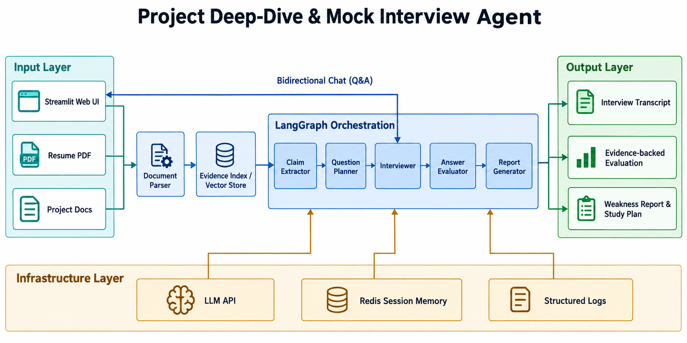

# Project Deep-Dive & Mock Interview Agent

一个为解决面试焦虑而开发的面向特定求职场景的项目经历深挖与模拟面试 Agent。

它接收用户的简历和项目材料，提取其中可验证的技术主张，围绕真实项目经历进行多轮追问，并最终生成基于证据的面试评估与学习建议。

> 当前状态：开发中。当前仓库处于 MVP 设计与初始化阶段。

## 1. 项目背景

在准备技术面试时，普通题库通常只能随机抽取“八股题”，很难围绕候选人真实做过的项目持续深挖。

例如，候选人在简历中写了“使用 Redis SessionStore 保存会话，并通过 TTL 处理过期”，面试官更关心的是：

- Session 续期如何实现？
- 多用户如何避免串话？
- Redis 宕机或会话失效时如何降级？
- 这个设计在多实例部署下是否仍然成立？

本项目希望构建一个能够读取简历和简历中项目材料、根据材料证据进行追问的模拟面试 Agent。它不只问“你会不会”，更关注“你是否真的理解自己写在项目里的内容”。

## 2. 核心目标

- 基于简历和项目材料生成有针对性的项目深挖问题。
- 在多轮对话中记住上下文，像真实面试官一样持续追问。
- 将用户回答与项目材料中的证据进行对照。
- 输出可解释的面试报告，包括掌握较好的技术点、薄弱点和后续学习建议。
- 避免泛化题库式问答，让问题尽可能来自用户自己的项目经历。

## 3. 目标用户

- 广大求职者。
- 想进行项目复盘和技术面试训练的开发者。
- 希望从真实项目材料中发现知识盲区的学习者。

## 4. 目标工作流

```text
简历 PDF / 项目 README / 设计文档
                ↓
           文档解析与切分
                ↓
        技术主张提取与证据索引
                ↓
       LangGraph 多节点面试工作流
                ↓
技术点规划 → 多轮追问 → 回答评估 → 报告生成
                ↓
      面试记录 / 薄弱点 / 学习计划

```

工作流程概念图：
